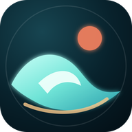

<p align="center">
  
</p>

<h1 align="center">Breakloom</h1>

<p align="center">
  <strong>Published from <code>main</code> through Vercel</strong>
</p>

Breakloom is a browser-based 3D surfing game driven by current marine forecast data. Pick an exact paddle-out on a real OpenStreetMap shoreline, read the local swell, walk into the water, paddle beyond the break, and surf a procedural wave set.

You can also walk up to the coast road, enter the Breakloom van, and drive more than a kilometer between peaks with three boards on the roof rack. The road, sand, wet shoreline, ocean, and device-adaptive coastal detail stream along the active traveler instead of ending at the original short showcase strip. Roadside wayfinding is projected from each destination's real surf-zone coordinates, while the HUD tracks signed along-coast distance and bearing.

Those three boards form a playable quiver: the Apex performance shortboard turns fastest and scores technical surfing, the Drift Twin fish carries speed through weaker sections, and the Horizon longboard paddles easily, stabilizes balance, and unlocks stronger nose rides. Their fiberglass shells flex and torsionally load under speed, stance, rail pressure, and landings before springing back on release.

## Play locally

```bash
npm install
npm run dev
```

Open [http://localhost:3000](http://localhost:3000).

## Deploy

Breakloom is a fully static build: `next build` emits `output: "export"`, and every
external call — Open-Meteo marine and forecast data, OpenStreetMap tiles — is made
from the browser to a CORS-enabled third party. There is no server runtime, no API
route, and no build-time fetch. Production publishing is intentionally limited to
Vercel.

**Vercel.** Import the repository and accept the defaults; `vercel.json` pins the
build directly to `next build` and sets immutable cache headers on the soundtrack,
models, textures, and icons, with the service worker held at `must-revalidate`. The
game deploys at the domain root, so no base path applies.

`npm test` runs the physics contract and the release artifact check, which holds the
app shell under 10 MiB and the soundtrack under 18 MiB, and fails if a track named in
`SOUNDTRACK` is missing from the build.

## Controls

- `WASD` or arrow keys: camera-relative movement on land, then paddle and steer in the water
- Hold `Shift` to run on desktop; push the mobile stick fully to run
- Click the open scene on desktop: lock the cursor for an unrestricted 360° view; press `Esc` to release
- Drag on touch: orbit the chase camera; double-click or double-tap to recenter
- `W` while riding: shift pressure toward the nose for trim and speed carry; it does not pull the board up the face
- `S` while riding: shift pressure toward the tail for tighter rail response and easier pivoting
- `Q` / `E`: shift body weight against measured board roll while prone or standing
- Mouse horizontal position: balance while riding
- `Space`: start a physical pop-up anywhere on the water; wave capture independently decides whether the completed stance rides or balances in place, then the same control loads maneuvers while riding
- `Space` at the parked van's driver door: enter; stop and press again to exit
- `C`: cycle Follow, Surfer POV, Immersive, and Cinematic cameras
- `P`: enter Photo Mode; frame with the same unrestricted mouse, touch, or gamepad camera, then capture and share/save a high-resolution shot
- Photo Mode: mouse wheel or `[` / `]` changes the 24–70 mm lens, `-` / `+` changes exposure, and `G` cycles composition guides
- Replay Studio: `Space` / gamepad A pauses, arrow keys or LB/RB scrub the line, `[` / `]` changes playback speed, `C` / Y selects a manual camera, and `R` restores the auto director
- `Esc`: pause
- Mobile: analog movement stick, physical-roll counterweight gauge with landing zones and haptic feedback, optional permission-gated phone-tilt counterweight, camera switcher, and a context-sensitive Move/Paddle/Catch/Trick/Drive button
- Supported controllers add restrained dual-motor surface feedback: sustained rail and cornering load on the low-frequency motor, fin chatter and grip release on the high-frequency motor, plus road, sand, and tire-slip texture in the van. Phones retain sparse tactile pulses for the strongest surface events.

The acoustic space follows the physical world. The van body low-passes and attenuates wind, rain, foam, and offshore wash while preserving engine and tire detail; entering a barrel progressively muffles the open beach, ducks the score, and raises a separate pressure-driven tubular roar around the rider.

A shuffled surf rock soundtrack runs underneath all of it. The running order is drawn once when the audio engine starts and then repeats, so no two sessions open the same way while a single session keeps a predictable order. It plays through the same music bus as the rest of the mix, so barrels, the van cabin, and going under all treat it like part of the world, and it can be muted at any time from the setup screen, the in-game HUD, or the pause menu.

The surfer now occupies that soundscape physically too. Paddle effort, board speed, and remaining stamina shape a restrained breathing cadence at the surface; demanding hold-downs replace that cadence with a stress-driven double heartbeat beneath the water, and the first clean crossing back through the surface releases a recovery gasp proportional to the breath actually remaining. These cues pause with the player and stay out of Photo Mode and Replay Studio, so they communicate live exertion without becoming a generic soundtrack loop.

Each coastline also carries a living landward acoustic identity. Rockaway and Snapper retain a distant moving urban wash; tropical breaks layer palms, insects, and bright island birds; dune, rugged, cold, volcanic, and desert coasts each use their own wind texture and sparse local wildlife or terrain cues. The bed remains spatially opposite the offshore surf, responds to local wind, rain, daylight, and the van cabin, and falls away continuously as the surfer paddles hundreds of meters from shore instead of following the player into the lineup.

Broken sections are now physical hazards rather than scenery. Crossing behind the moving pocket puts the board into the same whitewater field that drives the rendered foam: shoreward wash, down-line shove, speed loss, fin aeration, rail chatter, stamina drain, spray density, camera vibration, spatial sound, controller feedback, HUD pressure, and wipeout energy all rise continuously with contact. Replay Studio records that pressure signal so the foam load can be inspected frame by frame.

Barrels now have their own synchronized pressure field instead of being a visual and scoring state layered over ordinary face physics. The live pocket position, face height, hollow and steep break character, set energy, wind grooming, tide response, and encroaching whitewater determine tube pressure continuously. Entering that field adds down-line draw and crest capture while increasing face speed, stance compression, rail demand, fine balance turbulence, fatigue, tactile load, and wipeout energy. The HUD and coaching surface the same signal, so staying compact and making small high-line corrections has a physical reason.

Paddling uses directional board physics rather than continuous thrust. Holding forward or the mobile Paddle control advances alternating left/right pull-and-recovery cycles; only the submerged pull delivers force, and every recovery lets drag and current keep acting. A/D biases effort between the two hands, so an outside-side pull rotates the board against its measured yaw inertia instead of directly setting a heading. Current drift, hull drag, board dimensions, stamina, and retained momentum determine the resulting path. Every prone, still-standing, and riding board now uses the same four-point contact stack: nose, tail, and both rails explicitly sample the polygon surface; rail-to-rail height determines roll slope, shared rail lift drives heave, and separate nose/tail curvature drives pitch. Buoyancy and gravity integrate vertical motion, broadside water creates roll torque, and Q/E or the mobile balance control shifts the surfer's center of mass against that load. A rail pushed past its righting limit or a buried nose now separates the surfer from the board and carries the incoming wave, rail throw, and retained paddle momentum into the tumble. Pop-up body motion is independent from wave capture: pressing Space anywhere commits the hands, rear foot, and front foot on a stamina-dependent timeline even if the wave passes underneath. Those moving loads sink the hull, shift nose-to-tail pressure, raise the center of mass, and progressively replace paddle steering with standing counterweight. Wave pressure accumulates separately over sustained aligned hull contact instead of switching on at a capture threshold; lost contact, broadside load, or outrunning the face bleeds that pressure away until the board is simply coasting again. Ride distance and pocket-tracking bands no longer force a scripted ending: releasing wave pressure completes the surfed segment without touching the board's motion, while automatic dismounting is reserved for physically reaching the shallows. Completing the same physical pop-up can therefore become a driven ride or a difficult stationary balance depending on the board's real contact. The board keeps its velocity, yaw rate, roll, pitch, and vertical state throughout, without receiving a scripted speed, line, or leveled attitude. The playable ocean extends roughly 900 meters offshore with an always-readable range gauge, while the prone rig stays centered along the board. Hand-entry ripples, directional droplets, limb animation, and board force all consume the same physical stroke phase.

On supported phones, counterweight control can use the device motion sensor. Enabling Motion Balance requests access only from a direct tap, zeroes against the way the phone is currently held, and automatically recalibrates at the start of each ride. Roughly 17.5 degrees of device tilt reaches full counterweight, with smoothing that removes sensor chatter while preserving fast corrections; the roll target, landing window, and tactile cues stay live. Motion can be disabled instantly for the touch control, and browsers without orientation data remain unchanged.

The wider lineup gives traveling set crests physical volume beyond the active ride. Phase-solved translucent faces curve with each break, feather according to each wave's energy, remain readable from shore and offshore, and yield seamlessly to the detailed rider-scale breaker. Once a set reaches breaking depth, a rolling perforated foam sheet spreads behind its lip while fine spindrift rises, settles, and trails along the actual local wind vector. Both layers respond to wave energy, shoaling, break character, camera distance, and device quality, then hand off to the persistent impact-driven whitewater around the surfer. A separately displaced and absorption-shaded subsurface shell gives the ocean physical optical depth from grazing angles instead of exposing a paper-thin underside. On shore, the same live tide drives a drying gradient through the wet-sand bed: saturated grains, shallow pools, drainage streaks, wind-aligned ripples, broken sky and sun reflections, and individual rain rings continue beneath the animated run-up instead of ending at a matte strip.

Wave sets build and fade on the swell radar and in a directional breaker sound field. The ocean resolves a surfable primary wave train, dominant swell, current-bent cross sea, and wind-driven short-period sea; the CPU buoyancy surface and GPU ocean share their wavelengths, directions, amplitudes, shoaling, and phase speeds.

The surfboard has no hidden trough-to-lip lane and is never assigned crest velocity. It retains paddling momentum, samples the polygon surface under it, accelerates down the local slope through gravity, receives pressure from breaking water according to contact and orientation, and loses energy through longitudinal drag. Current acts through relative water velocity. A/D applies roll torque rather than yaw: board width, stability, speed, buoyancy, planing, cross-slope force, whitewater, and the rider's Q/E counterweight determine the evolving roll angle and rate. That measured bank loads the rail; only then can speed and fin grip redirect momentum. Excess bank catches an edge or capsizes the board. Nose and tail contact patches separately sample the polygon surface, so W/S stance pressure, longitudinal acceleration, local curvature, planing pressure, and immersion evolve real pitch. A buried nose decelerates into a pitch-over; a weighted tail sinks and stalls below planing speed. Vertical motion is also integrated: buoyancy, rising-water pressure, planing lift, hydrodynamic damping, and gravity determine heave. If a polygon face drops away, the hull becomes airborne and loses slope drive, wave pressure, rail authority, and water righting until it reconnects; landing load then depends on relative vertical speed and board attitude. The HUD and replay expose measured face position, roll, pitch, immersion, airborne height, and vertical velocity. Standing in flat water uses these same integrators, so the board coasts, drifts, rocks, pitches, or tips instead of entering a scripted state.

The resulting longitudinal and lateral forces drive stance compression, body lean, board flex and torsion, spray, wake density, carve tracks, camera response, sound, haptics, capture loss, and wipeout energy. Maneuver release is physical too: compression, tail pressure, upper-face position, speed, planing, hull contact, and board length determine a one-time vertical velocity impulse. There is no authored air arc - the heave integrator carries the board ballistically and removes rail authority in flight. Air rotations similarly apply one yaw impulse scaled by expected flight time and the board's rotational inertia; angular momentum then advances the real board heading while its horizontal velocity remains independent. Landing alignment therefore creates genuine sideslip instead of a cosmetic spin, and an air only scores after the requested rotation and an attitude- and balance-sensitive physical reconnection. A broadside wall loads the rail and can tumble the surfer; a slow board can be overtaken by the lip; a board that carries too far onto the shoulder loses the wave. Duck dives, hold-downs, separated board and leash motion, barrels, whitewater, replay telemetry, session objectives, grades, and personal bests remain synchronized with the same live water state.

Every completed wave now carries a telemetry-backed performance signature instead of only a raw score. Breakloom integrates takeoff timing, time spent in the power pocket, balance accuracy, rail slip, live wave energy, speed, rail commitment, barrel intensity, peak speed, and ride-specific combo from takeoff through the exit or fall. The broadcast-style recap reveals Entry, Line, Control, Power, and Variety grades, highlights the ride's strongest dimension and weakest focus, and turns the actual shortfall into a board-aware next-wave coaching call. Those same physics categories now contribute to World Tour judging, so a high heat score reflects the quality of the surfing rather than distance alone.

The breaking lip also leaves a persistent world-space whitewater field rather than a board-mounted decal. Individual foam patches advect more slowly than the crest, spread into perforated lace across the shoulder, follow the live displaced surface, intensify through collapsing sections and landings, and release detached mist that responds to the actual local wind. The pool automatically scales down on mobile while preserving the same motion.

Successful rides now keep that physical continuity all the way through the exit. The surfer releases steering and compression into a settled ride-out while the live crest retains control of the board; shallow finishes carry directly into a momentum-preserving step through the foam, while deeper lines transition prone at the exact offshore position instead of cutting or teleporting back to the beach. During each wave, Breakloom automatically captures the strongest takeoff, maneuver, or barrel moment from a dedicated in-engine cinematic camera. The best frame becomes a full-bleed, stat-backed ride card for native mobile sharing, with a generated graphic fallback on browsers that block WebGL capture or file sharing.

Every completed wave also retains a compact 24 Hz recording of the real board trajectory, heading, stance, rail load, balance, compression, barrel state, maneuver pose, crest offset, and wave-line telemetry. The ride recap can launch that recording in Replay Studio: player input pauses, the recorded path is phase-aligned to an equivalent crest in the still-running ocean, board elevation is recomputed against the live CPU water surface, and a four-cut auto director moves through Cinematic, Immersive, Follow, and final hero angles. The full transport is playable with mouse, touch, keyboard, or gamepad: pause on an exact frame, scrub anywhere along the line, inspect it at half-speed or accelerate to 1.5×, hand the cameras back to the auto director, or take over any rig with unrestricted free-look. Even a held frame remains attached to the moving live crest rather than freezing the sea around it. Replay Studio analyzes the recorded physics to detect the actual takeoff, strongest power pocket, maneuvers, barrel, and exit, then pins those moments to the timeline and calls them out as the playhead arrives. Live speed, line control, rail grip, stance, power, barrel, and maneuver telemetry update frame by frame on desktop and in a compact mobile broadcast strip. Replay completion or an early exit restores the exact live position, phase, motion state, camera choice, and buoyancy state so the session continues without a teleport or reset.

The persistent Surf Passport turns all thirteen coastlines into a non-gating World Tour. Each destination keeps its own ride count, clean finishes, best score and grade, longest line, pocket distance, maneuvers, and barrel record. Logging a wave, finishing clean, and landing an A-grade master line earn three progressively harder coast stamps; the World Tour panel provides stamped fast travel, the live HUD tracks the next mastery requirement, newly earned stamps animate into the ride recap, and cinematic share cards carry the current tour tier. Wave Lab remains an unrestricted sandbox and does not alter tour records.

Raw Ocean sessions can now run as open-ended Free Surf or as a five-minute World Tour Heat. Heat time starts only after the session reveal and pauses for the pause menu, Photo Mode, and Replay Studio. Each completed line receives a traditional 0–10 judge score built from execution, line length, pocket time, maneuver variety, barrel time, and whether the ride was made; only the best two waves count toward the 20-point total. The coast difficulty sets a distinct qualification target, the live HUD shows the clock, counting rides, required score, and judging objectives, and a ride already underway at the horn remains valid as the final wave. A full results ceremony ranks the scorecard, identifies the two counting rides, compares the qualification line, offers immediate rematch or Free Surf, and saves each coastline's best heat and qualification count in the Surf Passport.

Camera motion is derived from the active subject rather than a generic shake loop. Filtered velocity and acceleration produce directional chase lag, turn anticipation, physical horizon banking, speed-sensitive focal changes, and a damped spring response to takeoffs, landings, shorebreak hits, and van weight transfer. These effects are softened on mobile and disabled when the device requests reduced motion; unrestricted mouse, touch, and gamepad free look remains layered on top. Above-water orbit checks both a crest-sized camera footprint and five points along the camera-to-surfer sightline against the same displaced surface used by board physics. A damped lift and phase-aware orbit floor keep third-person rigs on the sky side of incoming lips without limiting 360-degree horizontal look, while intentional wipeout cameras can still cross into the modeled underwater world.

Photo Mode can hold player locomotion at any unpaused moment while a dedicated render path keeps the simulated water, weather, wildlife, lighting, character secondary motion, audio bed, and unrestricted camera framing alive. The player keeps the active Follow, POV, Immersive, or Cinematic rig, then selects a true 24, 35, 50, or 70 mm optical field of view, applies ±1.5 EV exposure compensation, and cycles rule-of-thirds, center-cross, or clean composition guides. Mouse-wheel and keyboard shortcuts complement the touch-sized director controls. An adaptive offscreen render captures the exact active camera and optical treatment as a high-resolution 16:9 JPEG; the saved frame receives restrained Breakloom, location, local-time, focal-length, exposure, wave-height, and period metadata, then uses the native mobile share sheet when available or downloads directly on desktop. Capture resolution scales with the device quality tier so photography does not compromise mobile play.

Runtime quality adapts through multi-second frame-time and jank windows rather than reacting to a single hitch. Sustained pressure lowers resolution first, then reduces expensive geometry and particles one tier at a time; severe stalls still trigger an immediate protective downgrade. Recovery requires several clean windows at the device's resolution ceiling, preventing quality from oscillating. Nonessential upgrades are deferred throughout paddling, active rides, wipeouts, Replay Studio, and Photo Mode so a crest, maneuver, or capture never causes a surprise detail rebuild, while emergency reductions remain available to protect control latency.

## Live data

Breakloom reads current and hourly forecast wave height, direction, period, dominant-swell height, swell direction, swell period, ocean current, sea level/tide, sea and air temperature, wind, cloud cover, sunrise, and sunset from [Open-Meteo](https://open-meteo.com/). Primary-wave, dominant-swell, current, and wind bearings remain separate all the way into the simulation: the primary vector aims the surfable wave field, the live swell crosses it at its reported angle and cadence, currents bend the cross sea and create longshore drift, and wind shapes short-period board motion, chop, spray, precipitation, cloud travel, balance, and barrel quality. Set energy is spatially attached to individual traveling crests, so the rendered wave volume, breaking foam, catch window, scoring physics, instruments, and audio all resolve the same three-wave group instead of pulsing the whole ocean at once. Sea temperature, air temperature, and wind chill select a climate-specific surf kit - from a hooded 5/4 with gloves and boots through sealed full suits, a spring suit, and tropical rashguard/boardshort coverage - while the setup conditions strip and session instruments identify the active equipment. Tide physically advances or exposes the playable shoreline, wet-sand band, wading depth, paddle transition, lineup, and breaking zone while keeping CPU board motion aligned with the rendered ocean. It also resolves against each break's bathymetry: drained sandbars become punchier and less predictable, low reefs and slabs grow steeper and hollower, full-tide points wrap into rounder walls, and canyon peaks remain dominated by deep-water focusing. The forecast strip scores each window against that seabed's preferred depth, while the CPU buoyancy field, GPU ocean, breaking lip, shorebreak, barrels, and wipeout demand share the same tide response. Wave Lab exposes each vector and the thermal conditions independently. Coastal model output is for gameplay and is not suitable for navigation. Shoreline maps use [OpenStreetMap](https://www.openstreetmap.org/) with visible attribution.

If the APIs are temporarily unavailable, each break has a modeled fallback so the game stays playable offline after its code has loaded.

## Character asset

The in-game surfer is an articulated Blender-authored GLB with named joints for the live walk, paddle, stance, maneuver, barrel, and wipeout poses. The current character uses athletic human proportions, tapered anatomy, a detailed face, five-finger hands, articulated bare feet, and layered wet hair. Four rig-compatible body variants provide dedicated cold-water, full-suit, spring-suit, and tropical coverage; the hooded setup keeps its facial detail while fitted glove and boot shells layer over neoprene hands and feet. Clean bonded torso and shoulder seams, shaped abrasion knee panels, a tighter wet-hair silhouette, PBR limestone neoprene, UV rashguard fabric, hydrophobic boardshorts, and restrained Breakloom branding respond to the selected destination and live thermal conditions. Procedural secondary motion adds exertion-aware breathing, idle gaze and weight shifts, while shared water exposure drives wet materials and post-session runoff droplets. Alternating footprints follow instantaneous travel direction through turns, mirror the left and right foot shapes, vary stride and toe-out, retain darker wet-sand impressions, lift subtle displaced-sand rims, kick adaptive dry grains, and disappear when the tide reaches them. Once the same gait enters the shallows, alternating world-space footfalls bloom across the moving CPU water surface, drift with the reported current, throw depth- and speed-sensitive droplets downwind, and scale their persistence and particle budget to the active device quality. The checked-in model can be regenerated on macOS with Blender installed:

```bash
/Applications/Blender.app/Contents/MacOS/Blender --background --python scripts/build-surfer-model.py
```

The script exports `public/models/surfer-premium.glb` and renders separate warm- and cold-water QA previews before the application build.

## Vehicle asset

The drivable two-tone surf expedition van is also Blender-authored. Its compact PBR GLB includes a modeled cabin and dash, all-terrain tires, detailed wheels, mirrors, lights, bumpers, awning, rear ladder and spare, plus a strapped three-board roof quiver. Entry and exit are staged through an authored hinged driver door carrying its own window, handle, mirror, and warm courtesy lamp. The interaction resolves at the physical driver-side opening: the surfer walks to the sill, ducks into the cabin, settles into the driving pose, and reverses that movement on exit while the camera and controls remain latched to the van until the door closes. Procedural latch/door foley completes the transition. The surfer remains visibly seated in the cabin while driving: an articulated in-vehicle pose connects both hands to a live steering wheel, works the pedals under throttle and braking, and loads the torso with acceleration, cornering, suspension travel, traction loss, and slip. Named door, steering-wheel, front-steering, wheel, body, headlight, and brake-light joints keep those details live in the driving simulation. Regenerate it with:

```bash
/Applications/Blender.app/Contents/MacOS/Blender --background --python scripts/build-van-model.py
```

The script exports `public/models/surf-van-premium.glb` and renders a local QA preview before the application build.

## Scope

This version is a high-quality vertical slice: one detailed surfer with five climate-reactive equipment kits, thirteen coastlines with urban, tropical, dune, cliff, cold-water, volcanic, and desert environments, selectable zones, synchronized hourly conditions, premium terrain materials, wind-shaped instanced dune grass, weather-reactive beach fabric, articulated coastal wildlife, a spring-loaded fiberglass three-board quiver with distinct silhouettes and hardware, live-data-driven multi-vector Gerstner seas with synchronized CPU buoyancy and bathymetry-aware tide response, a live breaking-wave face, stance/stamina/pocket/barrel/maneuver systems, stroke-synchronized paddle splashes, wind-deflected wake and spray, cinematic ride cameras, telemetry-backed five-category ride analysis and coaching, a fully controllable physics-recorded Replay Studio, best-two-wave World Tour Heats with persistent coast records, automatically selected gameplay-frame share cards, player-directed high-resolution Photo Mode, a persistent 13-coast Surf Passport, training/advanced/playground modes, destination records, a drivable surf van, adaptive procedural audio, and responsive desktop/mobile controls with opt-in calibrated motion balance. It is intentionally single-player; crowds and lineup etiquette are future systems.
